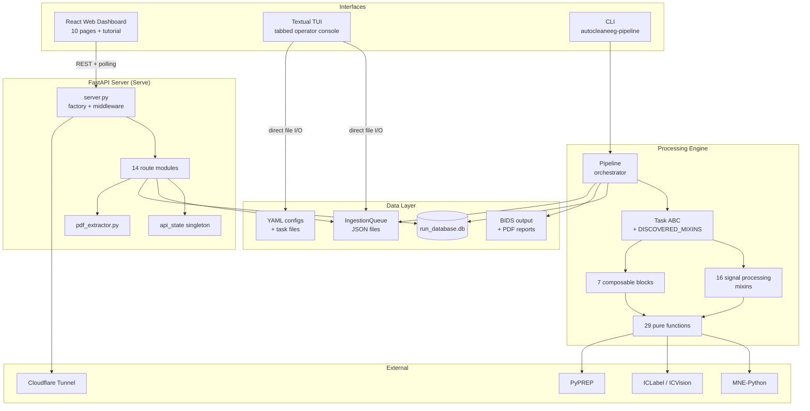
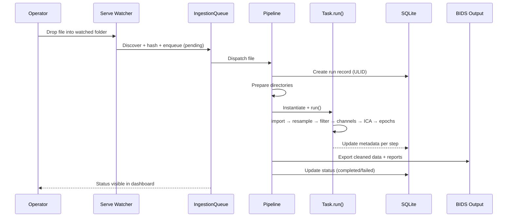
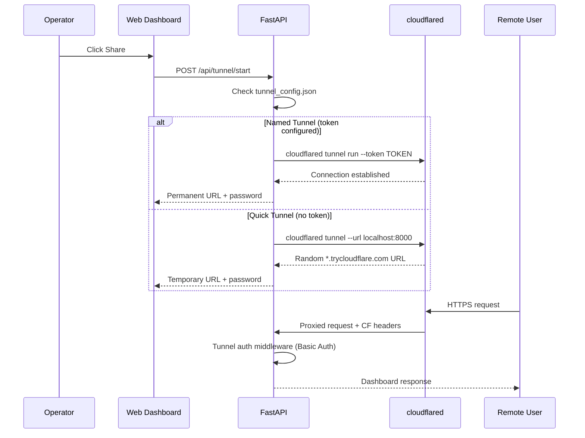

# Codebase Map

> Auto-generated by Cartographer. Last mapped: 2026-03-17

## System Overview



## Directory Structure

```
autocleaneeg_pipeline/
├── src/autoclean/
│   ├── core/              # Task ABC + Pipeline orchestrator
│   ├── mixins/            # 16 signal processing mixins (compose into Task)
│   │   ├── signal_processing/  # filter, ICA, epochs, artifacts, channels
│   │   ├── analysis/           # sensor PSD, ITC
│   │   ├── viz/                # plots, ICA reports, caching
│   │   ├── utils/              # BIDS path creation
│   │   └── reporting/          # ICA PDF generation
│   ├── blocks/            # 7 composable blocks (wavelet, autoreject, zapline, source, fooof)
│   ├── functions/         # 29 pure standalone functions (no self, no state)
│   │   ├── preprocessing/     # filter, resample, reference, wavelet
│   │   ├── ica/               # fit, classify, reject
│   │   ├── artifacts/         # bad channel detection (PyPREP)
│   │   ├── epoching/          # regular, event-locked, statistical learning
│   │   ├── segment_rejection/ # noisy/uncorrelated annotation
│   │   ├── visualization/     # plots, reports, ICA layouts
│   │   ├── advanced/          # autoreject integration
│   │   └── analysis/          # statistical learning ITC
│   ├── api/               # FastAPI server + 14 route modules
│   │   ├── server.py          # App factory, middleware, inline routes
│   │   ├── state.py           # Singleton workspace/Redis state
│   │   ├── pdf_extractor.py   # ICA PDF parsing (PyMuPDF)
│   │   └── routes/            # queue, service, routes, tasks, results, tunnel, etc.
│   ├── tui/               # Textual TUI (v2 tabbed, legacy sidebar)
│   │   ├── v2_app.py          # Main TUI app (1000+ lines)
│   │   ├── v2_state.py        # Typed workspace snapshot builder
│   │   ├── screens/           # Modal screens (route editor, queue, service, config)
│   │   └── widgets/           # Reusable TUI widgets
│   ├── tools/             # PyQt6 desktop tools (autoclean_exclude)
│   ├── plugins/           # Format + event processor plugins (implicit discovery)
│   ├── tasks/             # Built-in task implementations
│   ├── templates/         # Jinja2 task/report templates
│   ├── calc/              # ASSR, source connectivity, PSD analysis
│   ├── utils/             # 25 utility modules (ingestion, DB, auth, config, logging)
│   ├── data/              # Bundled builtins, montage files, templates
│   ├── configkit/         # Task config schema validation (v2025.09)
│   ├── io/                # Import (plugin-based) + export (.set/.fif)
│   ├── step_functions/    # BIDS + report generation functions
│   └── serve_launcher.py  # autocleaneeg-serve entry point
├── web/                   # React 19 + TypeScript + Tailwind CSS 4
│   └── src/
│       ├── pages/         # 10 page components
│       ├── components/    # 12 shared components + tutorial system
│       ├── contexts/      # ThemeContext, TutorialContext
│       ├── hooks/         # usePolling, useKeyboardShortcuts
│       └── lib/           # api.ts (full API client), format.ts
├── configs/               # montages.yaml (35 electrode systems)
├── tests/                 # Unit, integration, fixtures (69 files)
├── docker/                # Single-container deploy (supervisord + Redis)
├── docs/                  # Sphinx docs + platform guide
└── examples/              # Plugin examples, ICA caching, event discovery
```

## Module Guide

### Core Engine (`core/`)

**Purpose:** Task base class and Pipeline orchestrator.

| File | Purpose | Key Exports |
|------|---------|-------------|
| `task.py` | ABC that all tasks inherit; config validation, metadata, LLM reports | `Task` |
| `pipeline.py` | Per-file/batch processing, output dirs, DB records, reports | `Pipeline` |

**Composition:** `Task(ABC, *DISCOVERED_MIXINS)` — inherits from all discovered mixin classes dynamically. Two-level config: `self.config` (runtime paths/IDs from Pipeline) vs `self.settings` (processing params from task file's `config` dict).

### Mixins (`mixins/`)

**Purpose:** 16 signal processing mixins that compose into Task via multiple inheritance.

| Mixin | Methods | Config Keys |
|-------|---------|-------------|
| `BasicStepsMixin` | `filter_data`, `resample_data`, `rereference_data`, `drop_outer_layer`, `assign_eog_channels`, `trim_edges`, `crop_duration` | `filtering`, `resample_step`, `reference_step`, `drop_outerlayer`, `eog_step`, `trim_step`, `crop_step` |
| `ChannelsMixin` | `clean_bad_channels`, `drop_channels`, `set_channel_types` | `drop_outerlayer` |
| `IcaMixin` | `run_ica`, `classify_ica_components`, `apply_ica_component_rejection` | `ICA`, `component_rejection` |
| `RegularEpochsMixin` | `create_regular_epochs` | `epoch_settings` |
| `EventIDEpochsMixin` | `create_eventid_epochs` | `epoch_settings` (+ `event_id`) |
| `SegmentRejectionMixin` | `annotate_noisy_epochs`, `annotate_uncorrelated_epochs` | (always enabled) |
| `ArtifactsMixin` | `detect_dense_oscillatory_artifacts`, `detect_muscle_beta_focus` | (always enabled) |
| `GFPCleanEpochsMixin` | `gfp_clean_epochs` | (threshold-based) |
| `OutlierDetectionMixin` | `detect_outlier_epochs` | (config check commented out) |
| `SensorPSDMixin` | `apply_sensor_psd` | `apply_sensor_psd` |
| `ICAReportingMixin` | `generate_ica_reports`, `plot_ica_full` | (auto-called by IcaMixin) |
| `VisualizationMixin` | `plot_raw_vs_cleaned_overlay`, `psd_topo_figure` | (manual call) |
| `BIDSMixin` | `create_bids_path` | (auto) |
| `StatisticalLearningEpochsMixin` | `create_sl_epochs` | `epoch_settings` |
| `InterTrialCoherenceMixin` | `compute_itc_analysis` | `itc_analysis` |

**Discovery:** `mixins/__init__.py` scans 4 sources: BaseMixin > bundled blocks > internal mixins > external blocks. All collected alphabetically into `CombinedAutocleanMixins`. Method collisions produce warnings; MRO determines winner.

### Blocks (`blocks/`)

**Purpose:** 7 composable pipeline blocks registered in `registry.json`.

| Block | Category | Key Dependency |
|-------|----------|----------------|
| `wavelet_threshold` | signal_processing | `pywt` |
| `autoreject` | signal_processing | `autoreject` |
| `zapline` | signal_processing | `meegkit` (optional) |
| `fooof_periodic` | analysis | `specparam>=2.0` |
| `source_localization` | analysis | `autocleaneeg-eeg2source` |
| `source_psd` | analysis | `mne`, `joblib` |
| `source_connectivity` | analysis | `mne_connectivity`, `networkx`, `bctpy` |

Each block has `mixin.py` (pipeline glue) + `algorithm.py` (pure computation) + `manifest.json` (metadata).

### API Server (`api/`)

**Purpose:** FastAPI REST server powering the web dashboard and tunnel sharing.

**Route hierarchy (70+ endpoints):**

| Prefix | Module | Purpose |
|--------|--------|---------|
| `/health`, `/api/status` | `server.py` | Health check, workspace snapshot |
| `/api/mode/switch` | `server.py` | Test/live toggle |
| `/api/setup/workspace` | `server.py` | Workspace creation/selection |
| `/api/queue/*` | `queue.py` | Queue CRUD, retry, clear |
| `/api/routes/*` | `serve_routes.py` | Route specs CRUD, promote, archive, sync |
| `/api/service/*` | `service.py` | Start/stop service, live logs |
| `/api/config/*` | `config.py` | YAML viewer, validate, deploy |
| `/api/tunnel/*` | `tunnel.py` | Quick/Named tunnel management |
| `/api/tasks/*` | `task_browser.py` | Task introspection (config, pipeline, source) |
| `/api/task-manager/*` | `task_manager.py` | Install/create/remove tasks |
| `/api/montages/*` | `montage_browser.py` | Montage browser with topomaps |
| `/api/results/*` | `results.py` | Run results, artifacts, decisions |
| `/api/events/*` | `event_analyzer.py` | Single-file event analysis |
| `/api/filesystem/*` | `filesystem.py` | Server-side folder browser |
| `/api/tutorial/*` | `tutorial.py` | Guided onboarding |
| `/ws/events` | `events.py` | WebSocket (infrastructure, not yet wired) |

### Web Dashboard (`web/`)

**Purpose:** React 19 SPA with 10 pages, tutorial system, and polling-based state.

| Page | Polling | Key Features |
|------|---------|--------------|
| Dashboard | 5s | Status cards, recommendations, tutorial prompt |
| Routes | 10s | CRUD, promote to live, archive, folder browser |
| Queue | 5s | Status filters, detail panel, retry/clear |
| Service | 3s | Start/stop, live log viewer, advanced settings |
| Tasks | 60s | Library browser, install/create, pipeline flowchart |
| Montages | 120s | Category filter, topomap PNG, channel coordinates |
| Results | 30s | 6-tab detail (summary/report/plots/ICA/events/metadata), Pass/Fail/Review decisions, CSV/ZIP export |
| Events | one-shot | File picker, event type analysis, ISI stats |
| Settings | 30s | YAML viewer, validate, deploy |
| Setup | mount | Workspace picker, recent workspaces |

**State:** No global store. Server state via `usePolling`, tutorial via `TutorialContext`, theme via `ThemeContext`, everything else local.

### Utils (`utils/`)

**Purpose:** 25 utility modules shared by API, TUI, CLI, and Pipeline.

| Module | Purpose |
|--------|---------|
| `ingestion.py` | SHA256 provenance hashing, `IngestionQueue`, receipts |
| `database.py` | Thread-safe SQLite with optional compliance mode |
| `task_discovery.py` | Two-tier task scanning (workspace overrides builtins) |
| `serve_routes.py` | Route spec YAML CRUD + compilation to serve configs |
| `user_config.py` | Workspace location, custom task listing, setup wizard |
| `audit.py` | FDA 21 CFR Part 11 hash-chained audit trail |
| `auth.py` | Auth0 OAuth2, Fernet token storage, electronic signatures |
| `block_registry.py` | 3-tier GitHub-backed block registry (remote > cache > bundled) |
| `builtins.py` | Same pattern for builtin task files |
| `logging.py` | Loguru with custom HEADER level, error tracking |
| `bids.py` | MNE-BIDS conversion, concurrent participants.tsv |
| `config.py` | Compliance mode, YAML hash encoding (load_config deprecated) |
| `file_system.py` | Directory scaffolding, backup management |
| `montage.py` | `VALID_MONTAGES` from montages.yaml, GSN-to-10-20 mapping |

## Data Flow

### Single File Processing



### Tunnel Sharing



## Conventions

- **Mixin pattern:** Each method: check enabled → resolve data → call standalone function → update instance → save stage file → write metadata
- **Two-level config:** `self.config` (runtime paths from Pipeline) vs `self.settings` (processing params from task file)
- **Stage numbering:** Sequential `01_post_import`, `02_post_filter`, etc. via `_get_stage_number()`
- **Flagging:** `self.flagged = True` + reason; Pipeline skips `final_files/` copy for flagged runs
- **Config schema:** Version `"2025.09"` (exact match); validated by `configkit/schema.py`
- **Import style:** Heavy deps (MNE, matplotlib) lazy-imported inside functions or route handlers
- **Thread safety:** `threading.Lock` for module-level state (tunnel, service, results cache, DB)
- **File format:** EEGLAB `.set` preferred for export; BrainVision for BIDS

## Gotchas

1. **`DISCOVERED_MIXINS` fail-fast:** Any `ImportError` in any mixin file calls `sys.exit()` — a broken mixin kills the process
2. **matplotlib.use("Agg")** is set at import time in 3+ modules — affects the entire process; guarded with `get_backend()` check in montage_browser.py
3. **`load_config()` permanently raises RuntimeError** — YAML config loading is deprecated; all config via Python task files
4. **Compliance mode is one-way:** `enable_compliance_mode(permanent=True)` cannot be reversed via API
5. **Block cache wins over bundled:** `~/.config/autocleaneeg/.block_cache` has higher priority than `importlib.resources` bundled blocks — a stale cache overrides updates
6. **TUI and API are independent:** Both read/write the same workspace files directly; no shared locking beyond file-level atomicity
7. **WebSocket infrastructure exists but is not wired:** `events.py` broadcaster has emit functions but no route handler calls them yet
8. **ICA PDF indexing mismatch:** Summary tables use 1-indexed names (IC1), detail pages use 0-indexed (IC0) — reconciled positionally in `extract_ica_full`
9. **`formats/additional_formats.py` is side-effect only:** Must be imported before file routing or `.xdf`/`.edf`/`.gdf` extensions are unrecognized
10. **CI is disabled:** `ci.yml` is `.disabled`; only Claude review workflows are active

## Navigation Guide

**To add a new processing step:**
1. Add pure function in `functions/preprocessing/` (or appropriate subdir)
2. Add mixin method in `mixins/signal_processing/` calling the function
3. Add config key to `configkit/schema.py`
4. Call the method in your task file's `run()`

**To add a new API endpoint:**
1. Create or edit a route module in `api/routes/`
2. Register the router in `api/server.py` `create_app()`
3. Add TypeScript types + API method in `web/src/lib/api.ts`
4. Add UI in the appropriate page component

**To add a new task:**
1. Create `TaskName.py` with module-level `config` dict + `class TaskName(Task)`
2. Add to `data/builtins/` for distribution, or workspace `tasks/` dir for local use
3. Update `data/builtins/registry.json` if bundled

**To add a new block:**
1. Create `blocks/{category}/{block_name}/` with `mixin.py`, `algorithm.py`, `manifest.json`
2. Add entry to `blocks/registry.json`
3. Add config key pattern (`apply_*`) to `configkit/schema.py` dynamic validation

**To add a new web page:**
1. Create page component in `web/src/pages/`
2. Add route in `App.tsx`
3. Add nav item in `Sidebar.tsx` `navItems` array
4. Add page title in `TopBar.tsx` `pageTitles`
5. Add keyboard shortcut in `useKeyboardShortcuts.ts` if desired
