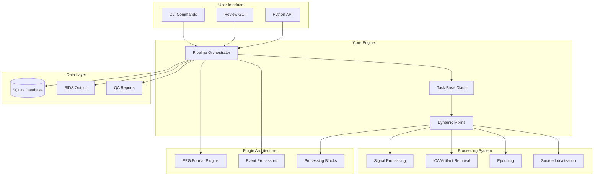
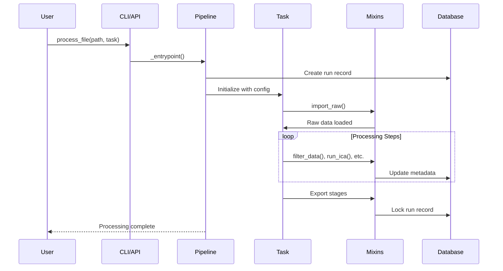
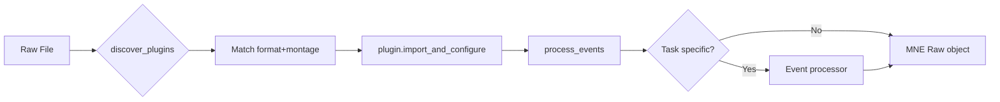
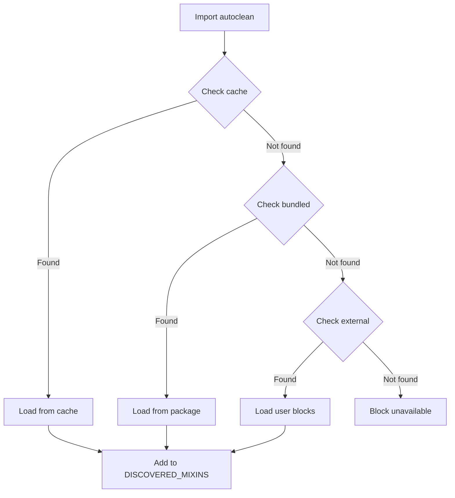

# Codebase Map

> Auto-generated by Cartographer. Last mapped: 2026-01-18

## System Overview



## Directory Structure

```
autocleaneeg_pipeline/
├── src/autoclean/                 # Main package
│   ├── core/                      # Pipeline and Task base classes
│   │   ├── pipeline.py            # Central orchestrator (10,338 tokens)
│   │   └── task.py                # Base class with mixin composition (3,776 tokens)
│   │
│   ├── mixins/                    # Processing components (auto-discovered)
│   │   ├── __init__.py            # Dynamic mixin discovery system
│   │   ├── base.py                # Common utilities for all mixins
│   │   ├── signal_processing/     # Filtering, ICA, epoching, channels
│   │   ├── viz/                   # Reports, plots, ICA visualization
│   │   ├── analysis/              # ITC, connectivity, wavelets
│   │   └── utils/                 # BIDS, file operations
│   │
│   ├── blocks/                    # Modular processing blocks
│   │   ├── registry.json          # Block registry with versions
│   │   ├── analysis/              # FOOOF, source localization, connectivity, PSD
│   │   └── signal_processing/     # AutoReject, Wavelet, Zapline
│   │
│   ├── functions/                 # Standalone processing functions
│   │   ├── preprocessing/         # filter, resample, rereference, wavelet
│   │   ├── epoching/              # regular, eventid, statistical learning
│   │   ├── ica/                   # fit, classify, apply
│   │   ├── artifacts/             # bad channel detection
│   │   ├── segment_rejection/     # noisy/uncorrelated detection
│   │   └── visualization/         # plots, reports
│   │
│   ├── plugins/                   # Auto-registered extensions
│   │   ├── eeg_plugins/           # Format handlers (BDF, EGI, EEGLAB, XDAT)
│   │   ├── event_processors/      # HBCD, P300, resting state
│   │   └── formats/               # Additional format registration
│   │
│   ├── io/                        # Import/export functions
│   │   ├── import_.py             # Plugin-based EEG import
│   │   └── export.py              # EEGLAB .set export, stage files
│   │
│   ├── utils/                     # Cross-cutting utilities
│   │   ├── database.py            # SQLite with audit trail
│   │   ├── audit.py               # FDA 21 CFR Part 11 compliance
│   │   ├── auth.py                # OAuth 2.0 authentication
│   │   ├── config.py              # Configuration management
│   │   ├── user_config.py         # Workspace management
│   │   ├── logging.py             # Loguru-based logging
│   │   ├── block_registry.py      # Remote block management
│   │   └── task_discovery.py      # Safe task loading
│   │
│   ├── calc/                      # Heavy computation modules
│   │   ├── source.py              # Source localization (38,869 tokens)
│   │   ├── assr_*.py              # ASSR analysis suite
│   │   └── source_*.py            # Source PSD/connectivity
│   │
│   ├── tasks/                     # Built-in task implementations
│   │   ├── RestingState_*.py      # Resting state variants
│   │   └── PhaseLocking_Entrain.py # Phase locking analysis
│   │
│   ├── configkit/                 # Configuration schema validation
│   │   └── schema.py              # Schema version 2025.09
│   │
│   ├── reporting/                 # Report generation
│   │   └── llm_reporting.py       # AI-powered summaries
│   │
│   ├── tools/                     # GUI and CLI tools
│   │   └── autoclean_review.py    # Interactive review GUI
│   │
│   ├── cli.py                     # Main CLI (76,721 tokens - large)
│   └── cli_blocks.py              # Block management CLI
│
├── tests/                         # Test suite (~105k tokens)
│   ├── conftest.py                # Central pytest configuration
│   ├── fixtures/                  # Synthetic data, test utilities
│   ├── unit/                      # Unit tests by module
│   ├── integration/               # End-to-end workflow tests
│   ├── functions/                 # Function-level tests
│   └── manual/                    # Visual validation tools
│
├── docs/                          # Documentation
│   ├── tutorials/                 # User guides
│   ├── api_reference/             # Auto-generated API docs
│   └── from-root/                 # CLAUDE.md, AGENTS.md
│
├── examples/                      # Usage examples
│   ├── amplitude_quality_coach_example.py
│   ├── event_discovery_example.py
│   └── ica_caching_example.py
│
├── configs/                       # Configuration files
│   └── montages.yaml              # Valid montage definitions
│
└── pyproject.toml                 # Package configuration
```

## Module Guide

### Core (`src/autoclean/core/`)

**Purpose**: Central orchestration and base class definitions

| File | Purpose | Tokens |
|------|---------|--------|
| pipeline.py | Pipeline orchestrator with async batch processing | 10,338 |
| task.py | Abstract base class with dynamic mixin inheritance | 3,776 |

**Key Exports**:
- `Pipeline` - Main entry point for processing
- `Task` - Base class that inherits all discovered mixins

**Dependencies**: All mixins via dynamic discovery
**Dependents**: All task implementations, CLI

**Patterns**:
- Registry pattern for tasks
- Thread-safe execution with locks
- ULID-based run tracking
- Dynamic task loading via importlib

**Gotchas**:
- Matplotlib backend forced to "Agg" for async operations
- Database records locked after completion (audit trail)
- Task name normalized to lowercase internally

---

### Mixins (`src/autoclean/mixins/`)

**Purpose**: Composable processing methods auto-discovered and combined into Task

| File | Purpose | Tokens |
|------|---------|--------|
| __init__.py | Dynamic mixin discovery system | ~150 |
| base.py | Common utilities (config, metadata, paths) | 4,853 |
| signal_processing/*.py | Filtering, ICA, epoching, channels | ~45,000 |
| viz/*.py | Reports, ICA visualization with caching | ~25,000 |
| analysis/*.py | ITC, connectivity analysis | ~3,000 |
| utils/bids.py | BIDS conversion utilities | 1,227 |

**Key Exports**:
- `DISCOVERED_MIXINS` - Tuple of all mixin classes
- `mixin_registry` - Dict mapping names to classes
- `BaseMixin` - Foundation with utilities

**Dependencies**: MNE, NumPy, standalone functions
**Dependents**: Task class (inherits all)

**Patterns**:
- Three-tier block discovery (cache → bundled → external)
- Method collision detection with warnings
- Configuration-driven execution via `_check_step_enabled()`
- Three-layer ICA caching (sources → PSDs → topographies)

**Gotchas**:
- Only classes with "Mixin" in name are discovered
- Python task settings override YAML silently
- ICA cache uses object ID (refitting creates new entry)

---

### Blocks (`src/autoclean/blocks/`)

**Purpose**: Modular processing blocks with versioning and remote updates

| Block | Category | Purpose |
|-------|----------|---------|
| autoreject | signal_processing | ML-based epoch cleaning |
| wavelet_threshold | signal_processing | DWT-based artifact removal |
| zapline | signal_processing | DSS line noise removal |
| fooof_periodic | analysis | Spectral parameterization |
| source_localization | analysis | MNE minimum norm → 68 ROIs |
| source_psd | analysis | ROI-level power spectra |
| source_connectivity | analysis | Functional connectivity |

**Architecture**:
```
Each block contains:
├── manifest.json      # Metadata, dependencies, API
├── mixin.py          # Processing mixin class
├── algorithm.py      # Core algorithms (optional)
└── README.md         # Documentation
```

**Key Features**:
- Version tracking with Git commits
- Three-tier priority (cache > bundled > external)
- Auto-discovery at import time
- Dependency checking before execution

**Gotchas**:
- Source localization v2.0 returns 68 ROIs (not 20k vertices)
- Downstream blocks have dual-mode for v1.0/v2.0 compatibility
- AutoReject requires minimum 20-30 epochs

---

### Functions (`src/autoclean/functions/`)

**Purpose**: Standalone processing functions usable outside pipeline

| Module | Key Functions | Tokens |
|--------|--------------|--------|
| preprocessing/ | filter_data, resample_data, wavelet_threshold | ~15,000 |
| epoching/ | create_regular_epochs, create_eventid_epochs | ~15,000 |
| ica/ | fit_ica, classify_ica_components, apply_rejection | ~7,000 |
| artifacts/ | detect_bad_channels, interpolate_bad_channels | ~3,000 |
| segment_rejection/ | annotate_noisy_segments, annotate_uncorrelated | ~8,000 |
| visualization/ | plot_raw_comparison, generate_processing_report | ~12,000 |

**Dependencies**: MNE, NumPy, SciPy, optional (autoreject, mne_icalabel, icvision)
**Dependents**: Mixins (wrap these functions)

**Patterns**:
- Pure functions accepting MNE objects
- Return (data, metadata) tuples
- Non-destructive (operate on copies)
- Modern MNE API (compute_tfr vs deprecated tfr_morlet)

**Gotchas**:
- ICVision gracefully falls back to ICLabel on failure
- Wavelet level auto-clamped to safe value
- Statistical learning functions specific to 30-syllable paradigm

---

### Plugins (`src/autoclean/plugins/`)

**Purpose**: Auto-registered extensions for formats, montages, and events

| Plugin Type | Count | Examples |
|------------|-------|----------|
| EEG Plugins | 13 | BioSemi BDF (32/64/128/256), EGI Raw, EEGLAB, XDAT |
| Event Processors | 3 | HBCD, P300, Resting State |
| Format Plugins | 6 | XDF, EDF, GDF, KIT, RDA, XDAT |

**Discovery Flow**:
1. Scan plugin directories at import
2. Match (format_id, montage_name) → EEG plugin
3. Match task_name → Event processor

**Key Plugin Patterns**:
- Channel renaming for montage compatibility
- Reference channel handling (VREF → Cz)
- Task-specific annotation processing
- Configuration-driven toggles

**Gotchas**:
- BioSemi status channel uses 16-bit trigger encoding
- XDAT requires Neo library (optional dependency)
- HBCD processor has multi-level config fallbacks

---

### Utils (`src/autoclean/utils/`)

**Purpose**: Cross-cutting concerns (logging, config, database, compliance)

| File | Purpose | Tokens |
|------|---------|--------|
| database.py | SQLite with triggers and hash chain | 8,289 |
| audit.py | FDA 21 CFR Part 11 compliance | 3,875 |
| auth.py | OAuth 2.0 with Auth0 | 6,188 |
| user_config.py | Workspace management | 9,637 |
| logging.py | Loguru with custom levels | 2,163 |
| config.py | Configuration validation | 4,000 |
| block_registry.py | Remote block management | 5,277 |
| task_discovery.py | Safe task loading | 3,351 |
| montage_validation.py | QA with HTML reports | 12,811 |

**Key Features**:
- Hash chain for tamper-proof audit trail
- Token encryption at rest (Fernet)
- Three-tier block/task discovery
- Themed Rich console output

**Gotchas**:
- Global DB_PATH must be set before database use
- Completed records cannot be modified (trigger enforced)
- Compliance mode cannot be disabled once permanent

---

### I/O (`src/autoclean/io/`)

**Purpose**: Plugin-based import and stage-aware export

| File | Purpose | Tokens |
|------|---------|--------|
| import_.py | Plugin discovery and EEG import | 5,616 |
| export.py | EEGLAB .set export with stage numbering | 6,230 |

**Key Exports**:
- `import_eeg()` - Main import with plugin routing
- `save_raw_to_set()`, `save_epochs_to_set()` - EEGLAB export
- `copy_final_files()` - Stage-numbered BIDS output

**Patterns**:
- Plugin auto-discovery with double-checked locking
- Event reconstruction from epoch metadata
- Sequential stage numbering (01_, 02_, etc.)

**Gotchas**:
- Event sample collision prevention
- Metadata truncated if count mismatch
- EEG-only channels in final exports

---

### Tests (`tests/`)

**Purpose**: Comprehensive test suite with synthetic data

| Directory | Purpose | Files |
|-----------|---------|-------|
| fixtures/ | Synthetic data generation, test utilities | 6 |
| unit/ | Module-level unit tests | 25 |
| integration/ | End-to-end workflow tests | 6 |
| functions/ | Function-level tests | 7 |
| manual/ | Visual validation tools | 2 |

**Key Fixtures**:
- `create_synthetic_raw()` - Generates realistic EEG
- `BaseTestCase` - Temp directory management
- `MockOperations` - Mock ICA/autoreject for speed

**Coverage Areas**: Core, mixins, plugins, functions, utils, integration

---

## Data Flow

### Processing Pipeline



### Import Flow



### Block Discovery



## Conventions

### Naming
- Mixins: `*Mixin` suffix (e.g., `BasicStepsMixin`)
- Plugins: `*Plugin` suffix (e.g., `BDFBiosemi64Plugin`)
- Tasks: CamelCase class name (e.g., `RestingStateBasic`)

### Configuration
```python
config = {
    "schema_version": "2025.09",
    "step_name": {
        "enabled": True,
        "value": {...}  # Step-specific params
    }
}
```

### Metadata Tracking
```python
self._update_metadata("step_name", {
    "timestamp": "2026-01-18T12:00:00Z",
    "key": "value"
})
```

### Error Handling
- `BlockDependencyError` - Missing block dependencies
- `RuntimeError` - Configuration validation failures
- Graceful fallbacks for optional features

## Gotchas

### Critical Non-obvious Behaviors

1. **Stage Numbering**: Sequential counter per run, not fixed numbers
2. **Flagged File Movement**: Controlled by `move_flagged_files` setting
3. **Event Reconstruction**: Epochs metadata → MNE events for EEGLAB export
4. **Auto-flagging**: Files <60s automatically flagged during import
5. **Plugin Discovery Race**: Pre-initialized in Pipeline.__init__
6. **Task Name Normalization**: Internally lowercase, preserves case for display
7. **Block Dependencies**: Missing deps stop batch processing immediately
8. **Source Localization v2.0**: Returns 68 ROIs, not 20k vertices
9. **ICA Cache Keys**: Use object ID, refitting creates new entries
10. **Database Triggers**: Prevent modification of completed/failed records

### Memory Considerations

- ICA sources cache: 500 MB default limit
- PSD cache: 100 MB default limit
- Topography cache: 200 MB default limit
- FOOOF processing: 16 GB recommended for vertex mode
- AutoReject: Scales with epochs × channels × CV folds

### Performance Tips

- Use ROI mode (v2.0+) for source analysis (10-20× faster)
- Enable ICA caching for visualization (17× speedup)
- Batch PSD computation (vectorized Welch)
- Parallel block execution where possible

## Navigation Guide

**To add a new EEG format**:
1. Create plugin in `src/autoclean/plugins/eeg_plugins/`
2. Implement `BaseEEGPlugin` interface
3. Register format in `plugins/formats/additional_formats.py`

**To add a new processing step**:
1. Create mixin in `src/autoclean/mixins/signal_processing/`
2. Follow `*Mixin` naming convention
3. Use `_check_step_enabled()` for config integration
4. Add to schema in `configkit/schema.py` if needed

**To add a new analysis block**:
1. Create directory in `src/autoclean/blocks/analysis/`
2. Add `manifest.json`, `mixin.py`, `algorithm.py`, `README.md`
3. Register in `blocks/registry.json`
4. Implement dual-mode if dependent on source localization

**To create a custom task**:
1. Create Python file with `config` dict and `Task` subclass
2. Place in workspace `tasks/` directory
3. Auto-discovered on next pipeline run

**To modify the CLI**:
1. Edit `src/autoclean/cli.py` (main commands)
2. Edit `src/autoclean/cli_blocks.py` (block commands)
3. Update help text and argument parsing

**To add tests**:
1. Use `create_synthetic_raw()` for test data
2. Follow pytest patterns in existing tests
3. Place in appropriate directory (unit/integration/functions)
4. Run `make test` to verify
